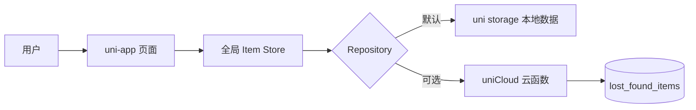
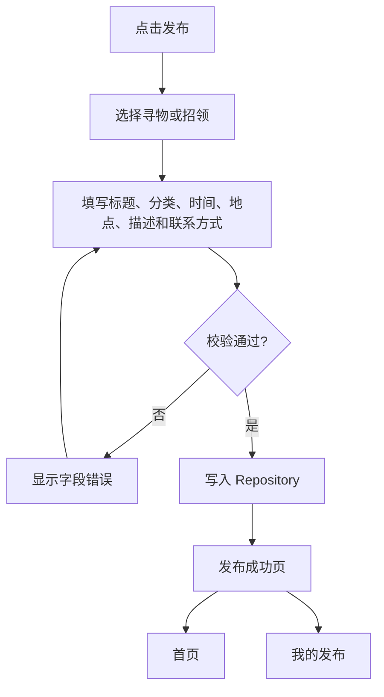
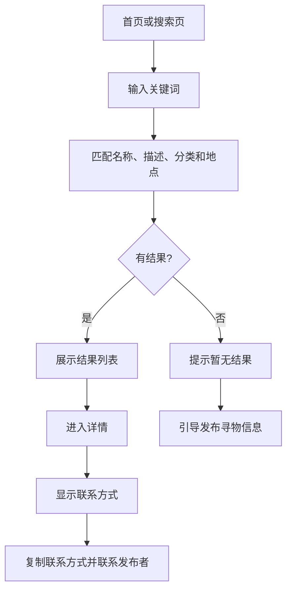

# 软件工程第四次作业


| 项目内容 | 说明 |
| --- | --- |
| 这个作业属于哪个课程 | [202601 软件工程 - 福州大学](https://edu.cnblogs.com/campus/fzu/202601SofwareEngineering) |
| 这个作业要求在哪里 | https://edu.cnblogs.com/campus/fzu/202601SofwareEngineering/homework/16744 |
| 这个作业的目标 | 基于第一次结对作业的原型，完成校园失物招领核心功能、测试、README 和 APP 构建 |
| 成员1 | 102401225 王圣杰 |
| 成员2 | 102401227 林子涵 |
| 结对同学博客 | https://www.cnblogs.com/halloween222 |
| 林子涵博客 | https://www.cnblogs.com/lin123454321 |
| 本作业博客 | https://www.cnblogs.com/lin123454321/p/23243040 |
| GitHub 项目地址 | [echo14670/102401225-102401227](https://github.com/echo14670/102401225-102401227) |


## 一、具体分工

| 成员 | 负责模块 | 主要提交 |
| --- | --- | --- |
| 102401227 林子涵 | uni-app 工程初始化、领域模型、表单校验、Repository、Store、首页、发布页、详情页、我的发布、Android 本地打包、基础测试与文档 | [d0ffc4c](https://github.com/echo14670/102401225-102401227/commit/d0ffc4cde50f905cd135c7a62589ebc1af402a55)、[488bf16](https://github.com/echo14670/102401225-102401227/commit/488bf16321e792da9c15f97998c608acb2f0df40)、[d23d91d](https://github.com/echo14670/102401225-102401227/commit/d23d91dc659685f6efbde321a29f62c7a04d13a6)、[490a5f6](https://github.com/echo14670/102401225-102401227/commit/490a5f67946c6a4495187377341c96e16f7e4973) |
| 102401225 王圣杰 | 搜索领域匹配、组合筛选、排序、搜索页面、首页搜索入口与地点筛选、搜索模块测试和文档，通过 fork 和 PR 提交 | [8cbea14](https://github.com/echo14670/102401225-102401227/commit/8cbea148cf75d22cde7d9f77257e41ca2657f575)、[0839409](https://github.com/echo14670/102401225-102401227/commit/0839409b8b7741315573fe8db0dc9d5ce103868a)、[e42a691](https://github.com/echo14670/102401225-102401227/commit/e42a6919d9ba0ba5cc32c3c77246cd61e856cf67)、[0b6a142](https://github.com/echo14670/102401225-102401227/commit/0b6a1422dc050931e7b28d078f6124ad6a90b9b0)、[d921466](https://github.com/echo14670/102401225-102401227/commit/d92146698c510f8b6622912b10b626d4a02df9b9) |

协作流程：

1. 林子涵完成基础工程和核心业务流程，推送 `main`。
2. 王圣杰 fork 主仓库，创建 `feature/search-and-filter` 分支。
3. 王圣杰按搜索领域、搜索页、首页筛选、测试、文档拆分 5 次提交。
4. 王圣杰发起 PR #1，林子涵审查后合并。
5. 最终 `main` 包含基础功能和搜索筛选模块，远端测试为 23/23 通过。

## 二、PSP 表

| PSP2.1 | 阶段 | 预估耗时（分钟） | 实际耗时（分钟） | 说明 |
| --- | --- | ---: | ---: | --- |
| Planning | 计划 | 30 | 35 | 阅读原型、作业要求和实现约束 |
| Estimate | 估计任务 | 20 | 25 | 估算页面、数据层、测试和 Android 构建 |
| Development | 开发 | 330 | 385 | 核心实现工作 |
| Analysis | 需求分析 | 35 | 40 | 对照 F1-F7 和三条流程图 |
| Design Spec | 生成设计文档 | 25 | 35 | 整理 Repository、数据结构和页面关系 |
| Design Review | 设计复审 | 20 | 25 | 检查状态文案、权限和必备页面 |
| Coding Standard | 代码规范 | 15 | 15 | 统一命名、目录和错误返回结构 |
| Design | 具体设计 | 35 | 45 | 本地存储、云适配器、页面状态设计 |
| Coding | 具体编码 | 210 | 260 | 6 个页面、组件、Repository 和云函数 |
| Code Review | 代码复审 | 30 | 35 | 检查状态同步、空结果和数据边界 |
| Test | 测试 | 70 | 80 | 自动化测试和构建排错 |
| Reporting | 报告 | 70 | 95 | README、测试说明、博客 |
| Test Report | 测试报告 | 25 | 35 | 汇总 23 个测试和构建结果 |
| Size Measurement | 计算工作量 | 10 | 15 | 统计文件、测试和构建产物 |
| Postmortem | 过程改进 | 20 | 30 | 记录工具安装和插件下载问题 |
| **合计** |  | **820** | **955** | 实际耗时高于预估，主要原因见第九节 |

## 三、解题思路与设计实现

本次没有重新设计产品，而是把第一次结对作业中的原型逐项变成代码。产品范围保持为 F1-F7，只实现浏览、寻物发布、招领发布、搜索、详情、联系、状态更新和“我的发布”，不实现登录、实名认证、即时聊天、地图定位和后台审核。

项目使用 uni-app、Vue 3 和 JavaScript 实现，默认使用本地 `uni storage`，同时提供可替换的 `uniCloud` Repository。页面不直接依赖具体存储实现，可以在后续部署云函数后切换数据源。

### 1. 整体数据流



### 2. 发布流程



### 3. 搜索与查看流程



### 4. 状态流转

```text
寻物：寻找中 -> 已找回 -> 寻找中（撤销）
招领：待认领 -> 已归还 -> 待认领（撤销）
```

状态修改只能由发布者执行。Repository 在写回前检查 `ownerId`，防止其他用户修改或删除信息。

## 四、关键代码

### 1. Repository 统一接口

页面只调用 `listItems/getItem/create/update/remove/changeStatus`。本地存储和 uniCloud 使用相同接口，页面不需要知道当前数据来自哪里。

```js
export function createRepository(options = {}) {
  const dataSource = options.dataSource || DATA_SOURCES.LOCAL;
  if (dataSource === DATA_SOURCES.UNICLOUD) {
    return createUniCloudRepository(options);
  }
  return createLocalRepository(options);
}
```

### 2. 搜索匹配

关键词统一去除多余空格并转成小写，再匹配标题、描述、分类和地点。

```js
export function matchesQuery(item, query) {
  const keyword = cleanText(query).toLocaleLowerCase();
  if (!keyword) return true;

  return [item.title, item.description, item.category, item.location]
    .map((value) => cleanText(value).toLocaleLowerCase())
    .some((value) => value.includes(keyword));
}
```

组合筛选支持类型、分类、状态、地点和排序条件。

```js
export function filterItems(items, filters = {}) {
  const {
    type = "all",
    category = "all",
    location = "",
    query = "",
    status = "all",
    sort = "desc"
  } = filters;

  const result = items.filter((item) => {
    if (type !== "all" && item.type !== type) return false;
    if (category !== "all" && item.category !== category) return false;
    if (status !== "all" && item.status !== status) return false;
    if (cleanText(location) && !cleanText(item.location).includes(cleanText(location))) {
      return false;
    }
    return matchesQuery(item, query);
  });

  return sortItems(result, sort);
}
```

### 3. 状态文案

寻物和招领使用不同的状态文案，避免把“已归还”错误显示为“已找回”。

```js
if (item.type === "lost") {
  return item.status === "resolved" ? "已找回" : "寻找中";
}
return item.status === "resolved" ? "已归还" : "待认领";
```

### 4. 本地持久化

新增、编辑、删除和状态修改完成后，Repository 会把最新快照写回 `uni storage`。应用重新打开后，数据仍然保留。

## 五、目录说明和使用说明

```text
campus-lost-found-app/
├─ pages/                    uni-app 页面
├─ components/               卡片、空状态、底部导航
├─ src/
│  ├─ domain/                数据模型、校验、搜索、状态文案
│  ├─ repositories/          本地和 uniCloud Repository
│  ├─ services/              存储适配、ID 生成
│  ├─ store/                 全局响应式状态
│  └─ config/                运行配置
├─ tests/                    Vitest 单元测试
├─ uniCloud-aliyun/          阿里云云函数和数据库 schema
├─ android-local/            DCloud Android 本地打包工程
├─ scripts/                  HBuilderX 资源同步和 APK 构建脚本
├─ docs/                     PSP、测试报告、博客和博客素材
└─ release/                  Release APK 与 SHA-256
```

测试人员可以选择两种方式运行：

1. APK 验收：安装 `release/campus-lost-found-1.0.0-release.apk`。
2. 源码验收：使用 HBuilderX 打开项目，运行到 Android App 基座或浏览器预览。

APK 信息：

- 包名：`com.lin.campuslostfound`
- 版本：`1.0.0`
- SHA-256：`38b40259accd06a326cb1afc31ea478d520d4f49cf95cbf6f345fe80740e9585`

## 六、附加特点

### 1. 分类和地点筛选

首页可以按物品类型、分类和地点筛选。设计意义是让用户从“全部信息”快速缩小到与自己有关的范围。实现上复用 `filterItems`，没有在页面中复制匹配逻辑。

### 2. 一键复制联系方式

联系方式默认隐藏，点击后才显示，并提供复制按钮。这样能减少联系方式被无关用户直接抓取，也让联系发布者的操作更短。

```js
function copyContact() {
  if (!item.value) return;
  contactVisible.value = true;
  uni.setClipboardData({
    data: item.value.contact,
    success: () => uni.showToast({ title: "联系方式已复制", icon: "success" })
  });
}
```

### 3. 数据导入导出和恢复

“我的发布”页面提供导出到剪贴板、从剪贴板导入 JSON、恢复示例数据三项工具，方便测试人员复现不同数据状态。

### 4. 可选照片和本地持久化

发布信息时可选照片，使用 `uni.chooseImage` 从相册或相机获取图片，并保存到应用数据目录。所有信息在关闭应用后仍然保留。

### 5. 可替换阿里云数据层

数据层同时提供本地 Repository 和 uniCloud Repository。由于页面只依赖统一接口，部署云函数后不需要重写页面。

## 七、单元测试

### 1. 测试工具和运行方法

项目使用 [Vitest](https://vitest.dev/) 编写和运行单元测试。Vitest 配置简单，可以直接运行 JavaScript 模块，适合本次以领域逻辑和 Repository 为主的测试。

测试步骤：

```powershell
npm install
npm test -- --reporter=verbose
```

当前结果：

```text
Test Files  5 passed (5)
Tests       23 passed (23)
```

### 2. 测试函数

测试覆盖以下模块：

| 测试文件 | 主要函数 | 测试内容 |
| --- | --- | --- |
| `tests/items.test.js` | `getStatusText`、`getActionText`、`getItemVisual`、`formatRelativeTime` | 寻物和招领的状态文案、操作文案、视觉信息和时间格式 |
| `tests/validation.test.js` | `validateItemDraft`、`validateStoredItem` | 有效表单、无效类型、标题长度、未来时间、控制字符和损坏对象 |
| `tests/search.test.js` | `matchesQuery`、`filterItems`、`sortItems` | 名称、描述、分类、地点搜索、大小写、空格、组合筛选、无结果和排序 |
| `tests/local-repository.test.js` | `createLocalRepository` | 初始化、发布、权限、编辑、状态、删除、导入导出和损坏恢复 |
| `tests/unicloud-repository.test.js` | `createUniCloudRepository` | 云函数 action 映射和错误封装 |

搜索模块测试示例：

```js
describe("search domain", () => {
  it("忽略关键词大小写和多余空格", () => {
    expect(matchesQuery(item({
      title: "Blue Campus Card",
      description: "Student card with number 0821."
    }), "  blue   campus card  ")).toBe(true);
  });

  it("没有匹配结果时返回空数组", () => {
    const result = filterItems([
      item({ id: "1", title: "校园卡" }),
      item({ id: "2", title: "雨伞" })
    ], {
      query: "不存在的物品"
    });

    expect(result).toEqual([]);
  });
});
```

### 3. 测试数据设计

- 正常数据使用校园卡、雨伞、耳机等原型示例。
- 边界数据覆盖最短和最大长度。
- 异常数据覆盖空值、错误类型、未来时间、控制字符和损坏 JSON。
- 权限数据使用不同 `ownerId`，验证只能修改自己的信息。
- 状态数据覆盖 `open/resolved` 与 `lost/found` 的四种组合。
- 云接口使用 fake `callFunction`，验证请求结构和错误转换。

可能被测试人员追问的情况包括：只输入空格、发生时间选择未来、关键词只出现在描述中、搜索无结果、招领状态显示错误、连续编辑删除后数据不一致、导入损坏 JSON，以及断网后本地流程是否仍然可用。

## 八、GitHub 代码签入记录

仓库提交记录：


PR 合并记录：


## 九、遇到的异常和结对困难

### 1. HBuilderX 与 DCloud SDK 版本不一致

问题：HBuilderX 5.24 首次运行时需要下载 `uniapp-cli-vite`，但本机 DCloud Android SDK 为 5.26，首次本地构建无法直接完成。

尝试：先同步 HBuilderX 与 Android SDK，再使用 HBuilderX 生成 appResource，最后交给 `android-local` 的 Gradle 工程打包。

结果：Gradle Release 构建成功，APK 通过 v1/v2 签名校验。

收获：本地打包依赖的不只是 Gradle 配置，工具链各组件版本也要一致。

### 2. 点击取消发布导致退出 APP

问题：从根页面进入发布页后点击取消，应用退出。

尝试：根页面取消改为返回首页，并拦截系统返回键。

结果：取消发布后应用保持运行，再进入发布页仍可正常操作。

### 3. 搜索无结果和状态同步

问题：搜索无结果时页面为空；编辑或修改状态后，其他页面可能显示旧数据。

尝试：搜索无结果时增加提示和发布寻物入口；所有写操作完成后更新全局 Store。

结果：首页、搜索页、详情页和“我的发布”使用同一份响应式数据，状态修改后立即同步。

## 十、队友评价


值得学习的地方：王圣杰对搜索模块的边界考虑比较完整，不仅实现了正常结果，还补充了大小写、空格、无结果和排序测试；

需要改进的地方：第一次提交时搜索页和首页筛选的说明不够完整，README 需要后来补充；
