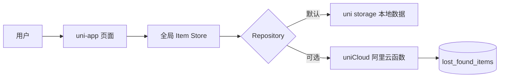
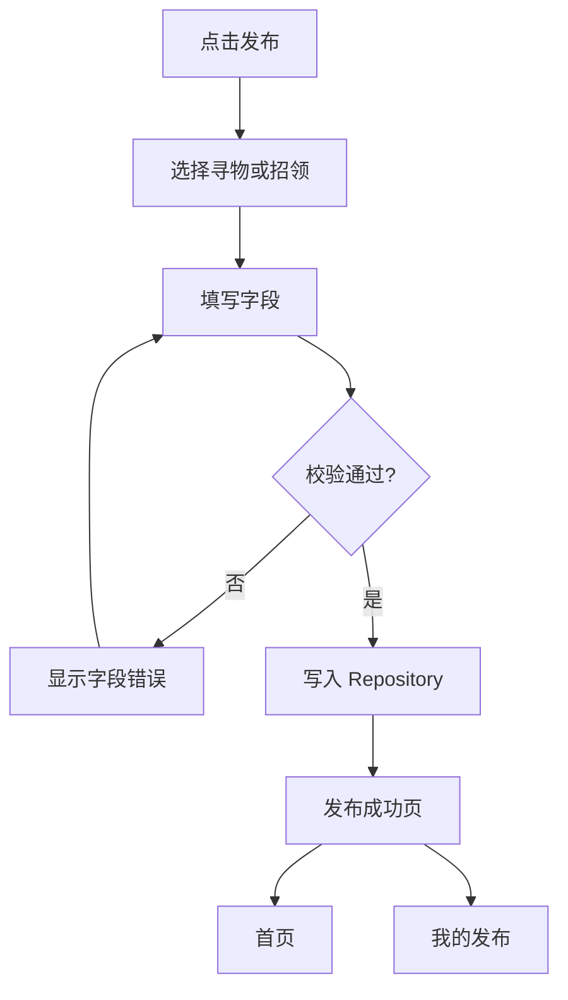
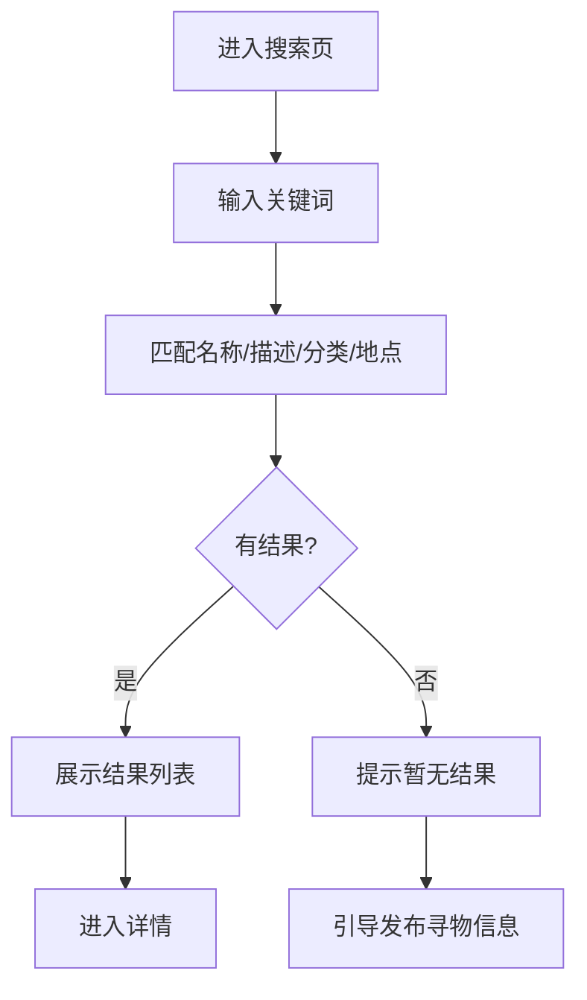

# 数据流与状态流

## 主数据流



## 发布流程



## 搜索流程



## 状态流

```text
寻物：寻找中 -> 已找回 -> 寻找中（撤销）
招领：待认领 -> 已归还 -> 待认领（撤销）
```

状态修改由发布者在详情页或“我的发布”触发，Repository 在写回前检查 `ownerId`。变更完成后，全局 Store 更新列表，首页、搜索、详情和我的发布使用同一份响应式数据。
